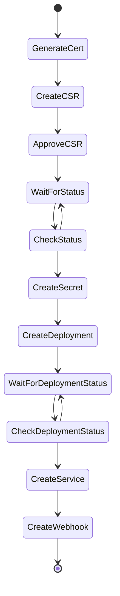

## Warning Experimental 
### Description
Webhook-helper is a kubernetes operator to automate the process of deploying [Admission Webhooks](https://kubernetes.io/docs/reference/access-authn-authz/extensible-admission-controllers/).  Both mutating Webhook & validating webhooks are supported.  

Webhook-helper 
* creates the certificate signing request
* approves the certificate signing request
* stores the certificate as a secret
* creates the service
* creates a deployment or pod with the attached secret with the certificate at `/webhook-helper/tls.crt` and private key at `/webhook-helper/tls.key`
* creates the webhook 

### Installation
1. `kubectl apply -f https://raw.githubusercontent.com/rc1405/webhook-helper/main/webhook-helper.yaml`
1. `kubectl get pods -n webhook-helper -w`
1.  Wait for bootstrap to finish deployment

### Usage
#### Example: example.yaml
```
apiVersion: webhook-helper.io/v1
kind: WebhookHelper
metadata:
  name: my-webhook
spec: 
  namespace: my-example-namespace
  listening_port: 8080
  webhook:
    apiVersion: admissionregistration.k8s.io/v1
    kind: ValidatingWebhookConfiguration
    metadata:
      name: ktlo
    webhooks:
      - name: ktlo.default.svc
        rules:
          - operations: ["CREATE", "UPDATE", "DELETE"]
            apiGroups: ["kubeto.io"]
            apiVersions: ["v1"]
            resources: ["definitions", "tasks"]
        failurePolicy: Fail
        admissionReviewVersions: ["v1", "v1beta1"]
        sideEffects: None
        timeoutSeconds: 5
  deployment:
    apiVersion: v1
    kind: Pod
    metadata:
      name: nginx
      namespace: my-example-namespace
    spec:
      containers:
      - name: nginx
        image: nginx:1.14.2
        ports:
        - containerPort: 8080
```
#### Field Breakdown
* `namespace`: Kubernetes namespace to deploy to (will overwrite anything in the deployment)
* `listening_port`: Port for the service to listen and redirect traffic to the deployment/pod to
* `webhook`: `ValidatingWebhookConfiguration` or `MutatingAdmissionWebhookConfiguration` configuration
* `deployment`: `Pod` or `Deployment` configuration

### Process Flow
#### Deployment


### Local Development
1. Run `cargo build --release --features local`
1. Run `docker build -t rc1405/webhook-helper .`
1. Update [deployment PodSpec](webhook-helper.yaml) and add `imagePullPolicy: Never`
1. Run `kubectl apply -f webhook-helper.yaml`

### Deletion
1. `kubectl delete -f https://raw.githubusercontent.com/rc1405/webhook-helper/main/webhook-helper.yaml`
1. `kubectl delete validatingwebhookconfigurations webhook-helper-admission`